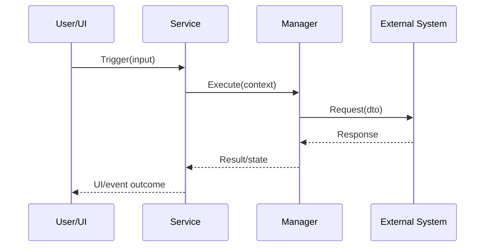

# 完整逻辑代码链条采集方法

## 核心原则

逻辑链不是文件清单，也不是“调用 A 后调用 B”的一句话。它应让未来读者在没有源码时，仍能在脑中执行一次完整流程，并理解数据在每一层如何变化。

## 采集顺序

### 1. 找到外部触发

记录真正的起点，例如：

- UI 点击或界面生命周期
- 网络消息
- 定时器或帧循环
- 登录/切服/场景切换
- 配置加载
- 编辑器菜单、构建脚本或命令行
- 第三方 SDK 回调

保留入口方法签名、触发条件和调用上下文。

### 2. 向下追踪主链

逐层记录：

```text
触发者
  → UI/Controller
  → Feature/Service/UseCase
  → Manager/Domain
  → Network/Database/SDK/Resource
  → 回调或响应
  → 状态更新
  → UI/事件/日志等最终结果
```

每个节点至少写：

- 类和方法
- 输入
- 核心判断
- 输出或副作用
- 下一跳

### 3. 追踪数据

列出关键 DTO、配置 Bean、枚举、缓存对象和状态字段。对每个字段说明：

- 来源
- 单位和格式
- 是否可空
- 生命周期
- 被谁修改
- 被谁消费

必要时给出表格：

| 字段 | 来源 | 变化 | 最终用途 | 风险 |
|---|---|---|---|---|

### 4. 追踪旁路

主链之外必须检查：

- 参数校验和提前返回
- 权限、功能开关和平台宏
- 网络失败和超时
- 空对象和生命周期失效
- 重试、缓存、补偿和幂等
- 并发和重复触发
- 资源释放、事件解绑和取消
- 编辑器、测试、WebGL、小游戏或渠道差异

### 5. 保存关键代码

每个关键节点至少保存以下之一：

- 代表性真实代码片段
- 保持变量和分支语义的脱敏代码
- 可执行级伪代码

代码片段要包含上下文，不要只截一行调用。至少能看出条件、参数、返回处理和副作用。

公开产出中避免整文件复制。保留最小但完整的逻辑单元，并写明省略了什么。

## 必备逻辑图

对三层以上或含异步回调的流程，使用 Mermaid 或文本时序：



图后必须配文字说明，不能只放图。

## 关键代码章节最低内容

`03-关键代码与数据结构.md` 至少包含：

1. 入口方法及触发条件
2. 上下文/请求对象构造
3. 核心业务方法
4. 外部系统或数据层调用
5. 响应/回调处理
6. 状态更新与最终输出
7. 错误、重试、去重或清理
8. 至少一个完整成功流程伪代码
9. 至少一个典型失败流程伪代码

## 成功流程模板

```text
当 <触发条件> 成立：
1. <入口> 接收 <输入>。
2. 校验 <条件>，失败时 <行为>。
3. 构建 <上下文/DTO>，字段来自 <来源>。
4. 调用 <服务/管理器>。
5. 服务执行 <核心规则>。
6. 调用 <网络/数据库/SDK>。
7. 收到 <响应/回调> 后校验 <成功条件>。
8. 更新 <状态/缓存/模型>。
9. 触发 <UI/事件/日志/后续流程>。
```

## 无源码可读性测试

暂时忽略所有源码路径，只阅读产出，检查能否回答：

- 功能从哪里开始？
- 参数如何一路传递？
- 核心条件在哪里判断？
- 外部系统何时介入？
- 成功和失败分别发生什么？
- 状态保存在哪里？
- 为什么不会重复、丢失或阻塞？
- 修改需求时应该改哪一层？

任何问题答不出来，都说明逻辑链仍不完整。


