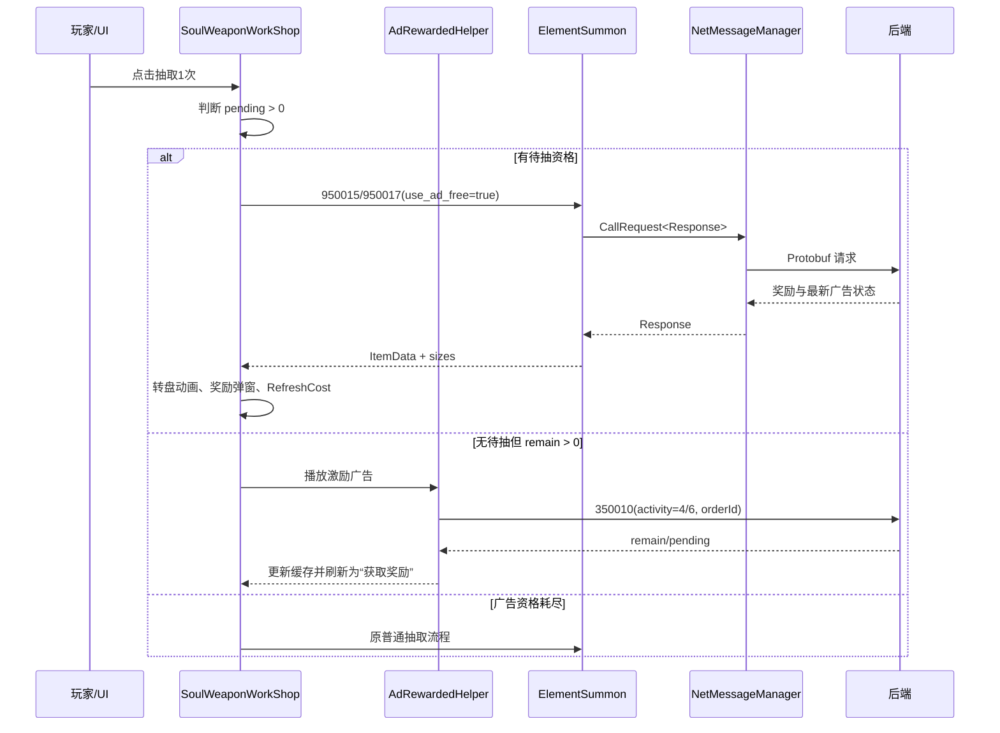

# 元件工坊广告抽奖｜项目复盘

> 状态：已完成
>
> 公司：广州小画网络科技有限公司
>
> 角色：Unity 客户端开发、协议联调与问题排查
>
> 技术栈：Unity/C#、HybridCLR Hotfix、UGUI、UniTask、Protobuf、SVN
>
> 一句话成果：在不破坏普通抽奖的前提下，为元件工坊初级和高级工坊接入“看广告领取资格—免费抽取”的完整客户端链路，并完成 UI 状态机、奖励展示和 SVN 提交整理。

## 1. 项目背景与目标

### 背景与痛点

元件工坊原本只有消耗道具的普通抽取。活动协议增加后，需要支持每日广告次数、待抽资格和免费单抽。早期实现曾出现广告按钮只做静态展示、点击仍扣道具、待领取状态不切换、免费抽有响应但不展示奖励等问题。

### 需求目标

- 初级工坊使用 `activity=6`、`350010`、`950017`。
- 高级工坊使用 `activity=4`、`350010`、`950015`。
- 每个工坊独立维护剩余广告次数和待抽资格。
- UI 按“可看广告 / 获取奖励 / 普通抽取”三态实时切换。
- 免费抽不得扣普通道具，成功后复用原工坊奖励动画和弹窗。

### 我的职责

我负责客户端协议调用、状态缓存、广告 SDK 回调接入、工坊按钮和消耗区域 UI 刷新、异常分支排查，以及 SVN Changelist 整理。后端奖池结算和广告订单校验由服务端负责。

### 范围与约束

本次只修改客户端 Hotfix 逻辑和已生成协议消费者，不改登录链路，不提交无关 SDK 元文件、缓存和本地设置。广告订单测试阶段使用 `mock_` 加随机 UUID 的订单号，真实接入时替换为 SDK 返回值。

## 2. 方案设计与权衡

### 整体方案

采用服务端状态驱动，而不是本地固定显示次数。页面初始化从 `ElementShopInfoResponse` 读取初级/高级广告状态；点击按钮时优先判断待抽资格，其次判断剩余广告次数，最后回退到原普通道具抽取。

### 为什么这样设计

待抽资格优先级高于剩余广告次数，才能保证流程严格交替：看广告后先领取一次免费抽，再允许继续看下一次广告。奖励展示统一进入原工坊的 `PresentDropResult`，避免广告抽和普通抽出现两套动画、日志和弹窗行为。

### 备选方案与取舍

曾考虑在 UI 层固定显示广告按钮，优点是改动快，但会造成服务端次数变化后 UI 与真实状态不一致，因此废弃。最终保留 Feature 层缓存状态、Controller 层负责状态映射的方案，代价是需要在每次协议响应后主动刷新 UI。

## 3. 架构与完整逻辑代码链条

### 模块职责

| 模块 | 职责 |
|---|---|
| `SoulWeaponWorkShop` | 处理按钮点击、三态 UI、广告/普通抽取分流、奖励动画 |
| `Features.Element.ElementSummon` | 构造 `950015/950017` 请求，解析奖励并缓存广告状态 |
| `AdRewardedHelper` | 播放激励广告、取得订单号、调用 `350010` |
| `NetMessageManager` | Protobuf 请求响应和 TipMessage 分发 |
| `RoleResource` | 将服务端奖励变化转换为客户端 `ItemData`，普通抽取扣费仍由原流程负责 |

### 总体流程图



### 完整成功调用链

页面打开时，`ElementSummon.RequestElementSummonInfo()` 更新两个工坊的 remain、pending、resetTime，并触发资源更新事件。`SoulWeaponWorkShop.RefreshCost()` 读取当前工坊对应字段：有 pending 显示普通背景和“获取奖励”；无 pending 但 remain 大于零显示广告按钮；两者都为零恢复普通按钮、原道具图标和“抽取1次”。

点击入口是 `OnClickBtnManufactureOne()`，调用 `SoulDrop(curType, 0)`。初级分支使用 `activity=6` 和 `950017`，高级分支使用 `activity=4` 和 `950015`。领取广告资格前必须确认 SDK 回调 `isEnded=true` 且 `adOrderId` 非空；服务端返回资格后不直接抽奖，而是刷新成待领取状态。下一次点击才发送免费抽请求。

### 失败、重试与补偿链路

- 广告未完整播放或订单号为空：直接返回，不调用 `350010`。
- `350010` 为空或失败：不修改本地资格状态。
- 免费抽响应为空、返回 TipMessage 或奖励列表为空：不播放动画，刷新状态等待重新处理。
- 面板在异步等待期间销毁：通过 `IsAlive()` 检查后停止后续 UI 操作。
- 普通抽取仍先执行原有道具检查和钻石确认，不与广告分支混用。

## 4. 核心代码与数据结构

### 核心字段

| 字段 | 来源 | 用途 |
|---|---|---|
| `PrimaryAdFreeDrawRemain` | `950014`/`950017` | 初级当天剩余可领奖广告次数 |
| `PrimaryAdFreeDrawPending` | `350010`/`950017` | 初级已领取但尚未免费抽的资格 |
| `AdvancedAdFreeDrawRemain` | `950014`/`950015` | 高级剩余广告次数 |
| `AdvancedAdFreeDrawPending` | `350010`/`950015` | 高级待抽资格 |
| `UseAdFree` | 抽取请求 | 区分免费抽与普通抽 |
| `IsTen` | 抽取请求 | 广告模式必须为单抽（`<=0`） |

### 核心业务伪代码

```text
SoulDrop(type, isTen=0):
  if type is Primary or Advanced:
    state = corresponding remain/pending
    if pending > 0:
      result = RequestElementDrop(isTen=0, useAdFree=true)
      if result has rewards:
        PresentDropResult(result)
      RefreshCost()
      return
    if remain > 0:
      ad = PlayRewardedAd()
      if ad not ended or orderId empty: return
      claim = ClaimAsync(activity, orderId)
      if claim valid: update remain/pending; RefreshCost()
      return
  execute original cost check and RequestSoulDrop()
  PresentDropResult(result)
```

`PresentDropResult` 是广告抽和普通抽共用的展示入口：保存奖励、刷新高级保底信息、播放转盘、处理跳过、打开奖励弹窗、刷新记录和消耗区域。

### 脱敏和省略说明

文档保留协议号、状态字段和关键分支；省略了项目内部资源 GUID、服务器地址、角色标识、完整生成 protobuf 代码和具体奖池数值。订单号示例使用随机测试格式，不包含玩家信息。

## 5. 测试验证与实际效果

### 测试矩阵

| 场景 | 操作 | 预期 | 实际 | 状态 |
|---|---|---|---|---|
| 初级首次广告 | 点击广告按钮 | 播放广告并领取资格 | 进入 `350010 activity=6` | 已验证 |
| 初级免费抽 | 再点击一次 | 调用 `950017`，不扣道具并展示奖励 | 已进入免费抽链路 | 已验证 |
| 高级首次广告 | 点击高级广告按钮 | 使用 `activity=4` | 客户端分支已确认 | 已验证 |
| 高级免费抽 | 待领取后点击 | 调用 `950015 use_ad_free=true` | 后端修复后可联调 | 已验证 |
| 广告用尽 | 完成两次循环 | 恢复普通按钮和原道具 UI | 已实现刷新 | 已验证 |
| 广告异常 | 空订单/TipMessage | 不扣资源、不展示假奖励 | 有提前返回 | 已验证 |

### 日志与观测点

联调期间曾增加 `[ElementAdDebug]` 临时日志，确认初级和高级分别进入 `350010`、`950017/950015`。功能确认后已删除这些临时日志；保留项目原有网络警告机制。

### 已验证工程效果

- 初级和高级广告活动编号分离，状态不会互相消费。
- 广告免费抽不再走普通道具扣费分支。
- 广告抽奖励复用原转盘和奖励弹窗。
- 相关 4 个客户端文件已整理到 SVN `element-workshop-ad` Changelist，未执行提交。

### 尚未验证的业务效果

真实广告 SDK 订单号、跨日重置和不同奖池配置需在后端正式环境继续验证；文档不对广告收益、转化率等业务指标作推断。

## 6. 风险复盘与改进

### 遇到的问题与根因

1. 把 pending 和 remain 显示成同一套广告 UI，导致领取资格后看不到“获取奖励”。
2. 免费抽请求后直接返回，没有接入原奖励展示流程。
3. UI 刷新只在进入页面执行，协议状态变化后图标和按钮滞后。
4. 高级工坊后端返回 TipMessage、奖励为空时，客户端无法凭空生成奖励，需服务端检查资格和奖池配置。

### 当前限制和技术债

- `RefreshCost` 仍承担较多 UI 状态职责，后续可抽成明确的状态枚举和渲染方法。
- 订单幂等和广告播放重试主要由服务端/SDK负责，客户端只做空值和完成态校验。
- 目前依赖生成协议文件同步，协议变更后应统一执行项目生成流程。

### 如果重新设计

定义 `AdDrawUiState { AdAvailable, RewardPending, Normal }`，让初级和高级只传入状态模型；将广告领取、免费抽和普通抽统一为返回 `DropResult` 的 UseCase，再由 Controller 负责渲染，减少条件分支和重复刷新。

## 7. 简历与面试材料

### 一句话项目介绍

为 Unity 元件工坊实现双活动广告免费抽完整链路，覆盖协议请求、订单校验回调、奖励展示及三态 UI 刷新。

### 简历精简版

设计并实现元件工坊初级/高级广告免费抽，通过活动状态分离、订单非空校验和统一奖励展示，解决广告按钮静态化、误扣道具及 UI 不刷新的问题。

### 简历技术版

基于 C#、UniTask、Protobuf 和 HybridCLR，在 `ElementSummon` 与 `SoulWeaponWorkShop` 中接入 `350010/950017/950015`，维护 remain/pending 状态，复用普通抽奖动画并完成 SVN 变更隔离。

### STAR 讲述

Situation：工坊只有道具抽取，新增广告协议后出现按钮显示与真实状态不一致。Task：我负责客户端完整联调且不能破坏普通抽取。Action：按活动编号拆分状态，建立“广告—待领取—普通”状态机，复用原奖励展示，并针对空订单、TipMessage、面板销毁增加保护。Result：初级和高级均能按协议进入对应分支，广告抽不再扣普通资源，最终变更被整理为单独 SVN Changelist。

### 高频追问与答案

- 为什么 pending 要优先？因为领取资格后必须先消费资格，避免连续看广告或绕过服务端次数。
- 为什么不在 UI 本地计数？服务端是次数和幂等的最终来源，本地计数会在重连、跨设备时失真。
- 奖励为空怎么处理？停止展示并保留服务端状态，记录为后端协议/奖池问题，不伪造客户端奖励。
- 如何保证普通抽不受影响？广告分支只在单抽且对应状态大于零时进入，否则执行原道具检查和普通请求。

### 不能夸大的内容

不能声称已验证真实广告平台收益、线上稳定性或业务转化率；当前证据主要是客户端代码、协议响应和联调日志。

## 8. 重新学习清单

### 推荐复习顺序

1. Protobuf 请求/响应与同协议号映射规则。
2. UniTask 异步生命周期和 Unity 面板销毁保护。
3. UGUI 组件状态渲染与资源异步加载。
4. SVN Changelist、生成代码同步和 HybridCLR 发布链路。

### 必须掌握的概念

活动状态机、订单幂等、pending/remain 语义、奖励预处理、异步提前返回、TipMessage 与业务响应的区别。

### 自测题

- 如果 `350010` 成功但 `950015` 返回空奖励，客户端和后端各自应检查什么？
- 为什么广告十连必须拒绝？
- 如何把初级和高级抽象成同一套 UI 状态模型？

## 9. 证据与脱敏说明

| 证据 | 当时位置/版本 | 提取的关键信息 | 脱敏说明 |
|---|---|---|---|
| 客户端源码差异 | SVN 工作副本，`element-workshop-ad` | 四个广告链路文件及调用关系 | 未复制完整源码 |
| 协议生成代码 | 客户端 `Element` protobuf 消费者 | `950015/950017` 字段与 `UseAdFree` | 未保留内部生成细节 |
| 联调日志 | Unity 客户端临时日志 | 高级 `950015` 请求曾返回 TipMessage/空奖励 | 已去除角色和订单信息 |
| SVN 状态 | Changelist 整理结果 | 仅保留四个任务文件 | 未执行提交 |

