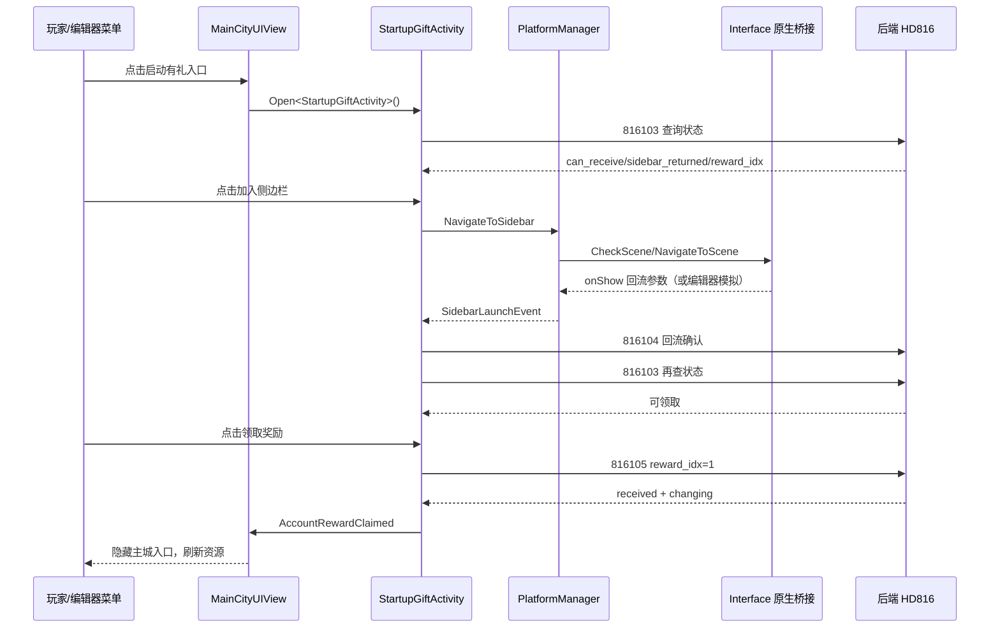

# 启动有礼 HD816｜项目复盘

> 状态：进行中（客户端链路已完成，真实后端发奖与抖音宿主验证依赖外部环境）
>
> 公司：广州小画网络科技有限公司
>
> 角色：Unity 客户端开发，负责启动有礼 UI、协议调用、平台桥接、编辑器测试和 SVN 冲突处理
>
> 技术栈：Unity/Tuanjie、UGUI、UniTask、Google Protobuf、Luban、SVN、Interface 原生桥接
>
> 一句话成果：独立实现启动有礼（HD816）从主城入口、奖励展示、侧边栏回流模拟到 816103/816104/816105 领奖链路，并将平台层从直接 TTSDK 引用改为 `Interface.Call` 桥接。

## 1. 项目背景与目标

### 背景与痛点

启动有礼是独立活动，不能复用超值首充的控制器、奖励格子或预制体。早期运行时出现入口无响应、加载错误活动预制体、奖励列表为空、按钮回流后不变化、协议生成文件重复等问题，需要从资源、UI、配置、网络和平台层逐段定位。

### 需求目标

- 使用独立 `StartupGiftActivity` 预制体和 `StartupGiftRewardCell` 奖励格子。
- 奖励展示读取 `qidongyouli` 配置，奖励档位固定为 `reward_idx=1`。
- 接入 HD816：816103 查询、816104 回流确认、816105 领奖。
- 编辑器内可模拟侧边栏回流，便于没有抖音宿主时验证状态机。
- 账号级一次性领取：服务端以 `Role.sdkOpenId` 为账号键，领取成功后同账号其他角色隐藏入口。
- 启动有礼平台调用不直接引用 `TTSDK`，统一走 `Interface.Call`。

### 我的职责

负责客户端 UI 控制器、主城入口、奖励列表绑定、协议调用、平台抽象层、编辑器测试菜单、编译错误和 SVN 冲突修复，并根据日志与后端反馈调整链路。

### 范围与约束

不修改超值首充；不使用 `ValueFirstCharge`/`ValueFirstChargeCell`；不在客户端伪造永久领取状态；不手工修改生成的 Protobuf 主体；抖音真实宿主桥接函数由原生层提供，当前项目只完成 C# 侧调用约定。

## 2. 方案设计与权衡

### 整体方案

UI 层只管理显示和状态；`PlatformManager` 暴露平台无关的侧边栏接口；`PlatformEditor` 在小游戏编译分支通过 `Interface.Call` 调原生层，在编辑器中保留测试菜单；HD816 协议由 `GameMessageManager` 发送；服务端决定账号资格和真实发奖。

### 为什么这样设计

将平台细节隔离在 `PlatformEditor`，可以避免 `StartupGiftActivity` 依赖平台包，也能让编辑器使用同一套 UI 状态机。账号资格不放本地缓存，避免换角色或清缓存后重复领取。奖励内容由 Luban/服务端配置提供，客户端只负责展示和消费 `PbResourceChanging`。

### 备选方案与取舍

曾出现“回流后直接本地改成可领取”的测试思路，但它绕过后端，无法发现 816104 落库延迟问题，因此改为模拟回流事件后仍真实发送 816104，再根据 816103 响应决定按钮状态。直接引用 TTSDK 虽简单，但违反项目平台封装约束，最终改用 `Interface.Call`。

## 3. 架构与完整逻辑代码链条

### 模块职责

| 模块 | 责任 |
|---|---|
| `MainCityUIView` | 创建启动有礼入口、查询账号状态、领取成功后隐藏入口 |
| `StartupGiftActivity` | 面板生命周期、奖励列表、按钮状态机、816 协议调用 |
| `StartupGiftRewardCell` | 独立奖励格子视图和物品数据展示 |
| `PlatformManager` | 统一侧边栏能力、解析回流参数、广播 `SidebarLaunchEvent` |
| `PlatformEditor` | 编辑器/小游戏平台实现；小游戏分支使用 `Interface.Call` |
| `GameMessageManager` | 发送 HD816 Protobuf 请求并接收响应 |
| `ConfigManager.DB.Qidongyouli` | 提供奖励展示配置 |

### 总体流程图



### 完整成功调用链

1. `MainCityUIView.EnsureTopPlatformButtons` 创建入口，入口标识为 `start_gift`。
2. 点击回调打开 `UI.Controllers.SpecialActivities.StartupGiftActivity`。
3. `Build` 查找 `Button`/`ClaimButton`、关闭按钮和 `Step3` 下的 `ListViewAdapter`，绑定事件。
4. `Init` 从 `ConfigManager.DB.Qidongyouli.GetByIdx(1)` 读取奖励，添加 `StartupGiftRewardCell` 数据。
5. `QueryInfoAsync` 发送 `HD816InfoRequest`（816103）。
6. 初始状态为 `NeedJoin`，按钮显示“加入侧边栏”。
7. 编辑器菜单 `Tools/UI/Startup Gift/Simulate Sidebar Return` 或真实平台回流触发 `PlatformManager.OnSidebarLaunch`。
8. 面板发送 `HD816SidebarReturnRequest`（816104）；成功后再次查询 816103。
9. 当 `sidebar_returned=true && can_receive=true`，状态为 `Claimable`，按钮显示“领取奖励”。
10. 点击后发送 `HD816ClaimRequest { RewardIdx=1 }`（816105）。
11. 收到 `received=true` 后调用 `RoleResource.OnReward(changing, true)`，触发 `AccountRewardClaimed`，主城入口隐藏。

### 失败、重试与补偿链路

- 816103 为空或异常：记录网络日志，不擅自标记已领取；主城查询失败时保留入口。
- 816104 返回空/`returned=false`：恢复 `NeedJoin`，按钮回到“加入侧边栏”。
- 领奖前没有 SDK 账号身份：记录 `sdk_open_id is empty`，拒绝发送 816105。
- 816105 为空、`received=false` 或异常：恢复 `Claimable`，允许重新查询/重试。
- `disposed`、重复查询、回流确认中或领奖中时提前返回，避免面板关闭后异步回调继续改 UI。
- 服务端 `status=1`（发放处理中）不能当作未领取重复请求；当前处理规则依赖后端返回语义，客户端不使用本地永久缓存。

### 数据流、状态与生命周期

```text
NeedJoin → Joining → Claimable → Joining → Claimed
                         ↑             ↓
                    816105失败      发奖成功
```

关键字段：`querying` 防止重复状态查询；`confirmingSidebar` 防止重复 816104；`claiming` 防止重复领奖；`disposed` 防止异步结果写入已销毁面板；`rewardIdx` 默认 1，服务端返回大于 0 时更新。

### 配置、网络、存储或平台链路

奖励显示来自 `qidongyouli` Luban 表；网络协议源为 `proto/src/HD816Gift.proto`，包括 816103/816104/816105；客户端账号身份只检查平台 `Uid` 是否存在，不用 `user_id` 或 `Role.id` 顶替；活动记录和原子发奖由服务端负责，当前客户端无法证明服务端事务实现。

## 4. 核心代码与数据结构

### 核心类与接口

```csharp
// 面板入口
[ViewType("Prefabs/UI/_BASE_VARIANT/SpecialActivities/StartupGiftActivity.prefab", false, false)]
public class StartupGiftActivity : Controller<Views.SpecialActivities.StartupGiftActivity> { }

// 平台抽象
public virtual void NavigateToSidebar(Action success, Action<int, string> failed) { }
public event Action<PlatformBase.SidebarLaunchInfo> SidebarLaunchEvent;
```

### 关键字段、DTO 与配置

| 字段/对象 | 来源 | 用途 |
|---|---|---|
| `can_receive` | 816103 | 是否允许显示领取按钮 |
| `sidebar_returned` | 816103 | 是否完成回流；已领取时后端应仍返回 true |
| `reward_idx` | 816103/816105 | 固定奖励档位 1 |
| `changing` | 816105 | 刷新钻石、金币、经验等资源 |
| `Role.sdkOpenId` | 登录会话/角色 | 服务端账号级唯一键 |
| `status` | 服务端记录 | 0 未领取，1 处理中，2 已领取；字段实际名称以当前后端为准 |

### 入口与上下文构建

主城入口使用 `PlatformButtonData(10004, "启动有礼", "main_icon-startgift", "start_gift")`。点击时打开独立控制器，不经过超值首充控制器。主城刷新 816103，收到账号已领取状态时隐藏入口；领取成功事件会立即隐藏并递增刷新版本，避免旧异步请求重新显示。

### 核心业务代码

```csharp
private async Task ConfirmSidebarReturnAsync()
{
    confirmingSidebar = true;
    var response = await GameManager.GameMessageManager
        .CallRequest<HD816SidebarReturnResponse>(new HD816SidebarReturnRequest());
    if (response == null || !response.Returned)
    {
        sidebarState = SidebarState.NeedJoin;
        return;
    }
    confirmingSidebar = false;
    await QueryInfoAsync();
}

private async Task ClaimAsync()
{
    if (claiming || sidebarState != SidebarState.Claimable || !HasSdkAccountIdentity()) return;
    claiming = true;
    var response = await GameManager.GameMessageManager.CallRequest<HD816ClaimResponse>(
        new HD816ClaimRequest { RewardIdx = 1 });
    if (response != null && response.Received)
    {
        await Manager.Instance.Get<RoleResource>().OnReward(response.Changing, true);
        sidebarState = SidebarState.Claimed;
        AccountRewardClaimed?.Invoke();
    }
    claiming = false;
}
```

### 回调、状态更新与最终结果

`PlatformManager.OnSidebarLaunch` 将 `launch_from=homepage && location=sidebar_card` 解析为 `IsFromSidebar=true`，再通过 `SidebarLaunchEvent` 通知面板。`UpdateClaimButton` 集中设置 `interactable` 和文案，避免按钮文字散落在多个回调中。领奖成功同时更新资源、面板状态和主城入口。

### 完整成功流程伪代码

```text
打开面板
→ 加载 qidongyouli 奖励
→ 816103
→ 若未回流：显示加入侧边栏
→ 编辑器菜单模拟回流
→ PlatformManager 广播回流事件
→ 816104 返回 returned=true
→ 816103 返回 can_receive=true/sidebar_returned=true
→ 显示领取奖励
→ 816105(reward_idx=1)
→ received=true
→ 应用 changing
→ 隐藏主城入口
```

### 典型失败流程伪代码

```text
模拟回流
→ 816104 返回成功
→ 816103 因后端落库延迟返回 sidebar_returned=false
→ 客户端保持加入侧边栏
→ 后端应检查 816104 是否真实保存 sdkOpenId 对应记录
```

### 脱敏和省略说明

文档未包含真实服务器地址、账号、令牌、内部 GUID 和完整生成代码。Protobuf 和 Luban 只记录源协议、字段语义和调用方式；代码片段为最小代表性片段。

## 5. 测试验证与实际效果

### 测试矩阵

| 场景 | 操作 | 预期 | 实际 | 状态 |
|---|---|---|---|---|
| 面板打开 | 点击主城启动有礼 | 打开独立 `StartupGiftActivity` | 日志显示正确控制器 | 已验证 |
| 奖励列表 | 读取 `qidongyouli` | 生成 3 个奖励项 | 日志 `reward adapter=True, config=True, count=3` | 已验证 |
| 编辑器回流 | 执行模拟菜单 | 发送 816104 | 日志显示 816104 请求 | 已验证 |
| 状态查询 | 816104 后查询 816103 | 服务端返回可领取后变更按钮 | 曾因后端落库延迟返回 false | 部分验证 |
| 领奖 | 点击领取 | 816105 返回 changing 并到账 | 依赖测试后端发奖 | 未完成 |
| 同账号多角色 | 两角色共用 sdkOpenId | 第二角色入口隐藏 | 依赖后端账号级数据 | 未完成 |
| 平台桥接 | 小游戏包调用 `Interface.Call` | 原生层执行 CheckScene/NavigateToScene | 原生桥接实现未在本环境确认 | 未完成 |

### 日志与观测点

重点日志包括：`internal button bound=True`、`request HD816SidebarReturnRequest proto=816104`、`request HD816InfoRequest proto=816103`、`info canReceive=...`、`request HD816ClaimRequest proto=816105`、`sdk_open_id is empty`。网络层还记录协议号和耗时，便于判断是客户端未发、服务端未返回还是状态未落库。

### 已验证工程效果

- 启动有礼入口能打开独立面板。
- 奖励格子解析为独立 `StartupGiftRewardCell`，并成功读取 3 项配置。
- 编辑器模拟菜单能注入标准回流参数。
- C# 启动有礼平台层已无 `TTSDK` 引用，改为 `Interface.Call`。
- 修复了重复 Protobuf 定义和 `WeeksCard` 类型歧义。

### 尚未验证的业务效果

真实抖音侧边栏添加、原生 `Interface.Call` 函数实现、后端发奖落库、跨角色账号级唯一性和服务端并发原子性尚未由当前环境独立证明。

## 6. 风险复盘与改进

### 遇到的问题与根因

早期误把超值首充预制体/奖励格子当参考实现直接复用，造成 UI 和类型串线；奖励列表只显示空 Cell 时，根因在 ListItem 预制体类型映射和数据链未完整接通；编辑器按钮直接改状态会掩盖后端落库延迟；协议重复文件导致 `CS0101/CS0111`；SVN 更新带来 `MainCityUIView`、Luban `.meta` 冲突。

### 当前限制和技术债

- `Interface.Call` 的原生函数名和 `onShow` 回调注册需要与宿主实现保持一致。
- 816104 后立即 816103 可能遇到后端异步落库延迟；更稳妥的后端方案是让 816104 成功响应成为可领奖权威结果，或提供短时一次性凭证。
- 服务端实际字段为 `claim_rid`、`claim_time`，文档不能误写成未实现的 `claim_role_id`、`claimed_at`。
- 当前没有命令行 Unity 编译环境，最终编译仍需团结编辑器验证。

### 如果重新设计

会先建立活动独立资源/协议清单，再实现最小状态机；把编辑器模拟工具放入明确的 Editor-only 目录；在协议联调前定义后端状态一致性和幂等契约；为 816104/816105 增加 request id 或服务端短时资格凭证，降低异步落库对前端体验的影响。

## 7. 简历与面试材料

### 一句话项目介绍

实现 Unity 启动有礼活动的独立 UI、HD816 协议链路和平台桥接，覆盖编辑器模拟回流、奖励展示、领奖资源刷新及账号级入口隐藏。

### 简历精简版

设计并实现 Unity 启动有礼活动，通过独立预制体、Luban 奖励配置和 HD816 Protobuf 状态机，完成入口、回流确认、领奖和资源刷新；将平台调用改为 `Interface.Call` 桥接，并增加编辑器模拟测试工具。

### 简历技术版

重构启动有礼客户端链路：以 `StartupGiftActivity` 管理 `NeedJoin/Joining/Claimable/Claimed` 状态，使用 816103/816104/816105 协议完成查询、回流确认和领奖，使用版本号、生命周期标记和事件解绑防止异步回调污染 UI；主城按账号状态隐藏入口。

### STAR 讲述

**S**：新活动误用首充资源，且回流后按钮和奖励列表无法稳定工作。  
**T**：在不影响其他活动的前提下，完成独立 UI、协议和测试链路。  
**A**：拆出独立预制体和奖励格子；沿主城→面板→平台抽象→网络协议逐层定位；用编辑器菜单模拟回流但保留真实 816104/816103；移除平台层 TTSDK 直接引用，改用 Interface 桥接；处理重复协议和 SVN 冲突。  
**R**：已验证独立面板、3 项奖励配置、编辑器回流和 C# 无 TTSDK 引用；真实后端发奖和宿主回调仍需联调。

### 3 分钟回答

核心难点不是按钮本身，而是“同一账号一次领取”的跨角色状态链。客户端不把 `Role.id` 当账号键，只把 `sdkOpenId` 作为后端会话身份的校验前提；UI 只根据 816103/816104/816105 响应变化。编辑器模拟工具只模拟回流参数，不能伪造领奖，这样能区分前端状态问题和后端落库问题。

### 高频追问与答案

1. **为什么不用本地缓存？** 本地缓存无法覆盖换角色、换设备和重复请求，资格必须由服务端账号状态决定。
2. **为什么不用 TTSDK？** 项目要求平台包由原生层封装，C# 通过 `Interface.Call` 保持平台依赖隔离。
3. **如何防重复点击？** `querying/confirmingSidebar/claiming/disposed` 和按钮交互状态共同限制并发。
4. **如何测试没有抖音宿主？** Editor-only 菜单注入标准 `launch_from/location/scene`，后半段仍发送真实 HD816 协议。
5. **当前最大未知是什么？** 后端事务/异步落库语义和原生桥接函数实现，需要测试服和宿主验证。

### 不能夸大的内容

不能声称已经完成真实抖音侧边栏、服务端事务原子性、跨角色发奖或线上业务增长指标；这些是当前证据未覆盖的部分。

## 8. 重新学习清单

### 推荐复习顺序

1. Unity UGUI 生命周期与预制体绑定。
2. UniTask 异步生命周期、取消和对象销毁。
3. Protobuf 协议生成与请求分发。
4. 平台抽象与 JS/原生桥接。
5. 账号级幂等、状态机和数据库一致性。
6. SVN 冲突、`.meta` GUID 和生成文件边界。

### 必须掌握的概念

`Role.sdkOpenId` 与 `Role.id` 的区别、`CanReceive/SidebarReturned/Received` 语义、`status=0/1/2`、ListView 的 Cell 类型映射、Interface.Call 同步/异步回调、Unity 对象销毁后的异步安全。

### 自测题

- 为什么 816104 成功后不能只凭客户端按钮直接证明能领奖？
- 如果 816103 返回已领取但 `sidebar_returned=false`，主城入口应如何处理？
- 同一 sdkOpenId 的两个角色为什么不能使用 `role_id` 作为唯一索引？
- `claiming` 和 `disposed` 分别防什么问题？
- 如何在不引用平台 SDK 包的前提下接收 `onShow` 参数？

## 9. 证据与脱敏说明

| 证据 | 当时位置/版本 | 提取的关键信息 | 脱敏说明 |
|---|---|---|---|
| 客户端源码 | `StartupGiftActivity.cs`、`MainCityUIView.cs` | 入口、状态机、协议调用、入口隐藏 | 仅保留最小代表性代码 |
| 平台源码 | `PlatformEditor.cs`、`PlatformManager.cs` | Interface.Call、回流解析和事件广播 | 删除平台包直接调用细节 |
| 协议源 | `proto/src/HD816Gift.proto` | 816103/816104/816105 和字段 | 未包含服务器地址和凭证 |
| 编辑器测试工具 | `StartupGiftEditorTestMenu.cs` | 模拟回流菜单与参数 | 参数为通用测试值 |
| 运行日志 | 启动有礼测试日志 | 面板打开、奖励数、816104/816103 请求 | 未保留账号、网络地址和 token |
| SVN 状态/冲突 | 工作副本 revision 记录 | 重复协议、MainCityUIView/Luban meta 冲突处理 | 未写入个人信息 |

脱敏说明：文档移除了真实服务器地址、账号标识、令牌、内部资源 GUID 和完整源码，仅保留可重建设计所需的类名、方法名、字段和伪代码。
