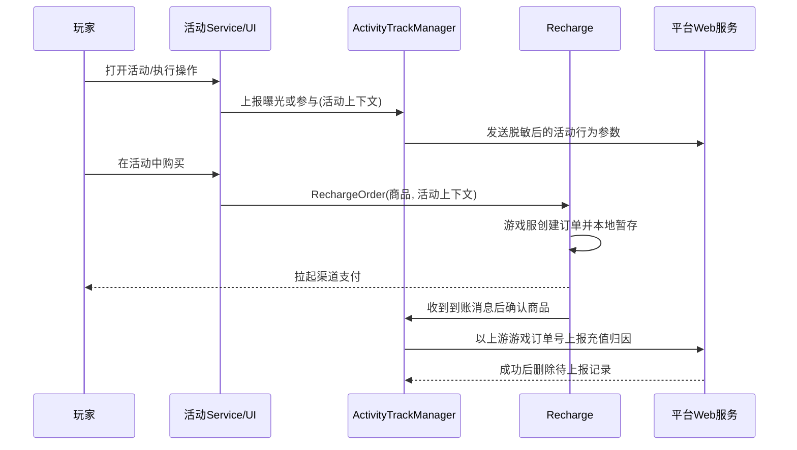

# 活动参与充值埋点｜项目复盘

> 状态：进行中（代码链已完成静态核验，尚缺联调与线上数据验证）
>
> 公司：广州小画网络科技有限公司
>
> 角色：Unity 客户端开发，负责活动曝光、参与、充值三类行为的统一采集与活动接入
>
> 技术栈：Unity/C#、HybridCLR、异步 Task、HTTP JSON、客户端持久化、SVN、Luban Excel 配置
>
> 一句话成果：建立活动上下文与统一埋点管理器，将分散活动行为接入曝光、参与、充值三段漏斗，并通过每日去重、订单暂存和登录补报提高数据可靠性。

## 1. 项目背景与目标

### 背景与痛点

运营需要分析玩家从看到活动、实际参与到完成充值的转化链路。原有活动数量多、实现分散，不同活动的领取、购买、抽奖、挑战等参与动作位于各自 Service 中；充值又经过游戏服下单、平台支付和到账消息，不能在“点击购买”时直接算充值成功。

本任务的核心不是增加一个 SDK 事件，而是让三个阶段使用同一组活动身份信息，并保证参与事件按天去重、充值事件以真实到账为准、失败后仍有补报机会。

### 需求目标与职责

- 统一上报活动曝光、参与和充值，携带角色、区服、渠道、活动 ID、运营标记及活动时间。
- 在具体活动的成功业务响应后接入参与埋点，避免把点击或失败请求误算为参与。
- 从活动购买入口透传活动上下文，订单创建后暂存，收到充值到账消息后再上报。
- 处理重复触发、并发请求、网络失败、重登和多角色缓存隔离。
- 核对配置表与代码覆盖范围，为后续补齐活动建立依据。

### 范围与约束

已验证范围为客户端源码、当前 SVN 工作副本和两份 Luban 源表。客户端向平台 Web 服务调用曝光、参与、充值三个接口，但当前本地后端目录没有找到对应控制器、数据库或统计实现，因此后端幂等键、落库结构和报表口径均标为未知。

## 2. 方案设计与权衡

### 整体方案

以 `ActivityTrackContext` 作为跨模块上下文，以 `ActivityTrackManager` 作为统一入口：活动界面打开时上报曝光；业务请求成功并更新活动状态后上报参与；活动内发起充值时把上下文传入充值模块，创建订单后落入待确认队列，到账后才上报充值。

参与和曝光采用“角色 + 区服 + 活动 + 类型 + 日期”的本地去重；充值采用游戏订单号作为业务身份，并持久化待上报订单。网络失败不删除记录，下次登录继续补报。

### 为什么这样设计

- 集中管理参数校验、网络请求、日志和去重，避免百余个活动重复实现。
- 埋点放在业务成功响应之后，比 UI 点击更接近真实参与。
- 充值以服务端到账消息确认，避免下单未支付、取消支付被误报。
- 活动上下文显式透传，避免充值模块反向猜测当前打开的活动。

备选方案是只在支付成功处根据商品 ID 反查活动，但同一商品可能被多个活动复用，无法稳定还原活动归因；只依赖后端也可实现归因，但当前订单请求需要客户端提供活动上下文，改造成本与协作范围更大。

## 3. 架构与完整逻辑代码链条

### 模块职责

| 模块 | 责任 |
|---|---|
| 活动配置与 `Promotion` | 提供活动 ID、是否运营活动、开始与结束时间 |
| 各活动 Service | 在领取、购买、抽奖、挑战等业务成功点触发参与埋点 |
| `ActivityTrackManager` | 构造请求、校验、去重、缓存、补报、统一日志 |
| `Recharge` | 创建游戏订单、保存扩展信息、拉起支付、接收到账消息 |
| Web 服务管理器 | 根据埋点类型选择接口，发送 JSON 并解析统一响应 |
| 平台后端 | 接收并记录数据；具体幂等与存储实现当前未知 |

### 总体流程



### 曝光链路

1. 管理器初始化时扫描 `PromotionViewAttribute`，建立“唯一窗口类型 → 活动 ID”映射，并监听 UI 打开事件。
2. 窗口打开后获取对应 `Promotion`；不存在则记录警告并结束。
3. 多个活动共用同一窗口时不自动猜测，由业务层使用真实 `Promotion` 主动上报。
4. `ReportDaily(Exposure)` 校验上下文、生成当天缓存键、阻止同一请求并发重复。
5. 后端返回成功且明确表示本次新增后才写本地日缓存。

### 参与链路

1. 玩家发起领取、购买、抽奖、刷新或挑战等活动操作。
2. 活动 Service 等待游戏服成功响应，先更新模块状态和 UI 数据。
3. 成功分支调用 `ReportParticipation(owner)`；失败、空响应和提前返回不触发。
4. 管理器从 `Promotion` 提取活动 ID、运营属性和有效期，执行与曝光相同的每日去重上报。

当前工作副本中有 105 个活动 Service 文件发生改动，新增 153 个参与埋点调用；全量代码中有 103 个 Service 文件包含参与上报，共 156 个调用点。这说明一次活动可能有多个合法参与动作，不能用“调用点数量”等同于“活动数量”。

### 充值链路

1. 活动购买方法调用带 `Promotion` 或 `ActivityTrackContext` 的 `RechargeOrder` 重载。
2. 充值模块向游戏服创建订单，获得游戏订单号、商品 ID、金额和扩展信息。
3. 代金券完全抵扣时走非现金购买链路，不继续记录现金充值归因。
4. 正常渠道保存订单扩展参数成功后，将订单号、商品 ID 和活动上下文写入本地待确认列表，再拉起 SDK 支付。
5. 客户端收到充值奖励/到账消息后，以商品 ID 找到第一个未确认订单，标记已支付并立即上报。
6. 上报返回业务成功后删除该订单；失败则保留。下次登录遍历已支付未删除记录并补报。
7. 编辑器 GM 支付也会登记并立即确认，用于开发验证，但不能代表真实渠道支付结果。

### 失败、去重与边界

- 上下文、角色、区服、活动 ID 或运营标记非法时直接拒绝。
- 曝光/参与使用内存集合避免同一时刻并发请求，使用本地日期缓存避免每日重复。
- 缓存键已加入角色 ID，防止同设备同区服切换角色后错误复用去重状态。
- 充值待确认列表按游戏订单号去重，上报中集合阻止同一订单并发发送。
- 网络异常只记录日志，不写每日成功缓存、不删除充值记录。
- 风险：到账消息只携带商品 ID 时，若同商品存在多笔未完成订单，当前“取第一个未支付记录”可能错配；更稳妥的方案是到账协议回传游戏订单号。

## 4. 核心代码与数据结构

### 关键字段

| 字段 | 来源 | 用途 |
|---|---|---|
| `promotionId` | 活动对象/控制表 | 统一标识归属活动 |
| `isOperate` | 活动类型或显式参数 | 区分运营活动口径 |
| 活动起止时间 | 活动 Duty | 区分活动批次，毫秒转换为秒 |
| 角色、区服、渠道 | 玩家与启动参数 | 用户和投放维度归因 |
| 游戏订单号 | 创建订单响应 | 充值幂等与归因身份 |
| `isRecorded` | 后端响应 | 判断本次是否真正新增记录 |

### 代表性伪代码

```csharp
async Task<bool> ReportDaily(type, context) {
    if (!Valid(context)) return false;
    key = $"type-role-server-promotion";
    if (local[key] == serverDate) return true;
    if (!inFlight.Add(key + serverDate)) return false;
    try {
        response = await web.Report(type, BuildRequest(context));
        if (response.success && response.isNewRecord) {
            local[key] = serverDate;
            return true;
        }
        return false;
    } finally { inFlight.Remove(key + serverDate); }
}
```

```csharp
async Task ReportPaidOrder(pending) {
    if (!pending.isPaid || !reportingOrders.Add(pending.orderId)) return;
    try {
        response = await ReportRecharge(pending.orderId, pending.context);
        if (response.success) {
            pendingOrders.RemoveByOrderId(pending.orderId);
            Save();
        }
    } finally { reportingOrders.Remove(pending.orderId); }
}
```

真实接口路径、平台地址、商品编码与完整业务源码未写入公开文档；代码仅保留能够解释设计的等价伪代码。

## 5. 测试验证与实际效果

### 测试矩阵

| 场景 | 预期 | 当前证据 | 状态 |
|---|---|---|---|
| 同角色同活动当天重复参与 | 只新增一次 | 缓存键与并发集合静态核验 | 已验证代码 |
| 同设备切换角色 | 不共享去重结果 | 缓存键包含角色 ID 的工作副本差异 | 已验证代码 |
| 下单后取消支付 | 不上报充值 | 只有到账消息调用确认 | 已验证代码 |
| 到账后网络失败 | 保留记录，重登补报 | 持久化列表与登录补报链 | 已验证代码 |
| 多笔相同商品并发充值 | 应准确关联订单 | 到账仅按商品 ID 查找 | 风险未解决 |
| 后端重复请求幂等 | 不重复落库 | 仅看到响应字段，后端源码缺失 | 未知 |
| 真机渠道支付与线上报表 | 数据一致 | 尚无联调日志和报表对账 | 未验证 |

### 配置覆盖核对

`HD活动控制表.xlsx` 是活动定义全集的主要来源，表中 186 行含 4 行 Luban 元数据，即 182 条活动配置；它包含活动 ID、显示控制、是否运营活动等信息。`CZ充值商品.xlsx` 管理商品与价格、商品逻辑分类，共 803 行和 66 个分类数据项附近的配置规模，它不是活动全集，只解决“买什么商品”的问题。

因此“后端也是这个表吗”不能从客户端仓库确认。可以确认客户端活动身份主要来自活动控制表，充值商品来自充值商品表；后端是否读取同源导出数据、是否有独立白名单或运营后台配置，目前未知。

代码覆盖不能只与 182 条配置机械比较：部分活动可能停用、仅展示、没有独立参与动作、复用窗口或由通用基类上报。但当前缺少自动化映射清单，无法证明所有应埋活动均已覆盖。工程上应生成“活动 ID—Service—曝光入口—参与成功点—充值入口—状态”矩阵，并由产品/数据确认排除项。

### 已验证效果与未验证效果

已验证的是统一了参数模型、支持每日和并发去重、将充值判定延后到到账、增加失败保留与登录补报，并将日志归入 Web 服务类别。尚不能声称提升了转化率、收入或数据准确率百分比，因为缺少上线前后报表、后端落库和数据平台对账证据。

## 6. 风险复盘与改进

- 最大风险是商品 ID 与订单号关联不充分，应让到账消息携带订单号或维护可验证的订单匹配规则。
- 参与调用点由人工分散接入，容易漏活动或把埋点放到响应前；应建立静态扫描和配置覆盖检查。
- `async` 弃置任务依赖内部捕获异常，虽然当前管理器已捕获，但调用方无法感知失败；可增加统一失败指标和队列监控。
- 本地缓存可能被清理，最终幂等仍应由后端基于角色、活动、日期或订单号保证。
- 活动起止时间单位在历史接口中可能不一致，应统一为明确的 Unix 秒值并做契约测试。

如果重新设计，我会用配置生成覆盖清单；参与事件通过统一业务结果事件或受约束接口接入；充值上下文随订单写入服务端，由服务端到账时完成最终归因；客户端只负责采集入口上下文和补充观测。

## 7. 简历与面试材料

### 简历描述

- 设计并落地 Unity 活动曝光、参与、充值三阶段埋点体系，通过统一活动上下文、每日去重、订单持久化与登录补报，覆盖百余个活动服务的关键成功行为。
- 打通活动购买到支付到账的异步归因链路，将充值埋点从“点击/下单”延后至到账确认，并识别相同商品多订单匹配风险及后端幂等边界。

### STAR 与 3 分钟回答

项目要解决的是运营无法稳定分析活动曝光、参与和充值漏斗。我的任务是统一客户端采集方式，并接入大量历史活动。实现时先抽象活动上下文，包含活动 ID、运营属性和有效期，再由统一管理器负责参数、网络、去重、缓存和日志。曝光从 UI 打开事件触发；参与必须放在业务请求成功并更新状态之后；充值则从活动购买入口透传上下文，创建订单后缓存，只有收到到账消息才上报，失败记录保留到下次登录补发。

难点一是活动多且入口分散，我在百余个 Service 中定位真实成功点，而不是简单统计按钮点击；难点二是支付异步且可能取消，因此使用订单状态机把下单和到账分开；难点三是重复数据，通过角色、区服、活动、日期和订单维度做客户端去重。静态检查已证明完整主链成立，但后端源码和线上报表不在当前证据范围，因此我不会夸大业务指标，并提出用配置覆盖矩阵和订单号回传完善可靠性。

### 高频追问

1. **为什么不能点击购买就上报充值？** 点击、下单和支付到账不是同一事实，用户可能取消或支付失败。
2. **为什么参与按天去重？** 需求口径是活动日活式参与记录；只有后端确认新增才缓存，失败仍可重试。
3. **活动是不是都覆盖了？** 活动表有 182 条配置，代码有 103 个 Service 文件包含参与上报，但二者不是一一对应；没有排除清单前不能宣称全覆盖。
4. **充值商品表是不是活动表？** 不是。活动控制表定义活动身份和运营属性，充值商品表定义商品、价格及逻辑分类。
5. **如何防止重复充值上报？** 客户端按订单号去重和保存；最终跨设备、重装幂等必须由后端保证，当前后端实现未知。
6. **个人完成了什么？** 统一管理器及上下文设计、活动成功点接入、充值上下文透传、缓存补报、去重和覆盖核查。

不能夸大为“埋点绝不丢失”“所有活动 100% 覆盖”或“提升充值转化率”，除非后续补齐后端实现、联调记录和线上数据对账。

## 8. 重新学习清单

复习顺序：先背三段漏斗及触发时机，再画充值订单状态链，然后解释两个去重集合与持久化队列，最后回答活动表和充值表为何不能混用。

必须掌握：活动上下文的字段来源；成功点埋参与的原因；下单与到账分离；客户端与后端幂等边界；配置覆盖不能只比数量。

自测题：如何处理同商品两笔订单？本地缓存被清理怎么办？多活动共用窗口如何确定曝光归属？新增一个活动时需要检查哪些入口？怎样用数据证明上线有效？

## 9. 证据与脱敏说明

| 证据 | 提取的关键信息 | 事实等级 | 脱敏说明 |
|---|---|---|---|
| 活动埋点管理器及工作副本差异 | 上下文、日去重、订单缓存、登录补报、角色隔离 | 已验证 | 仅保留结构与伪代码 |
| 充值模块与到账消息 | 活动上下文透传、下单登记、到账确认 | 已验证 | 隐去平台参数和商品编码 |
| Web 服务客户端契约 | 三类接口、公共请求字段、统一响应 | 已验证 | 隐去真实地址和路径 |
| 105 个活动 Service 的 SVN 差异 | 153 个新增参与调用点，7 个充值上下文接入点 | 已验证 | 不公开完整业务实现 |
| `HD活动控制表.xlsx` | 182 条活动配置及运营标记字段 | 已验证 | 不复制内部活动明细 |
| `CZ充值商品.xlsx` | 商品配置与逻辑分类，不是活动全集 | 已验证 | 不公开渠道商品编码 |
| 本地后端目录搜索 | 未找到对应埋点控制器和存储实现 | 已验证当前环境 | 内部仓库地址未记录 |
| 后端幂等、落库、报表效果 | 当前无法确认 | 未知 | 等待接口文档或联调证据 |
