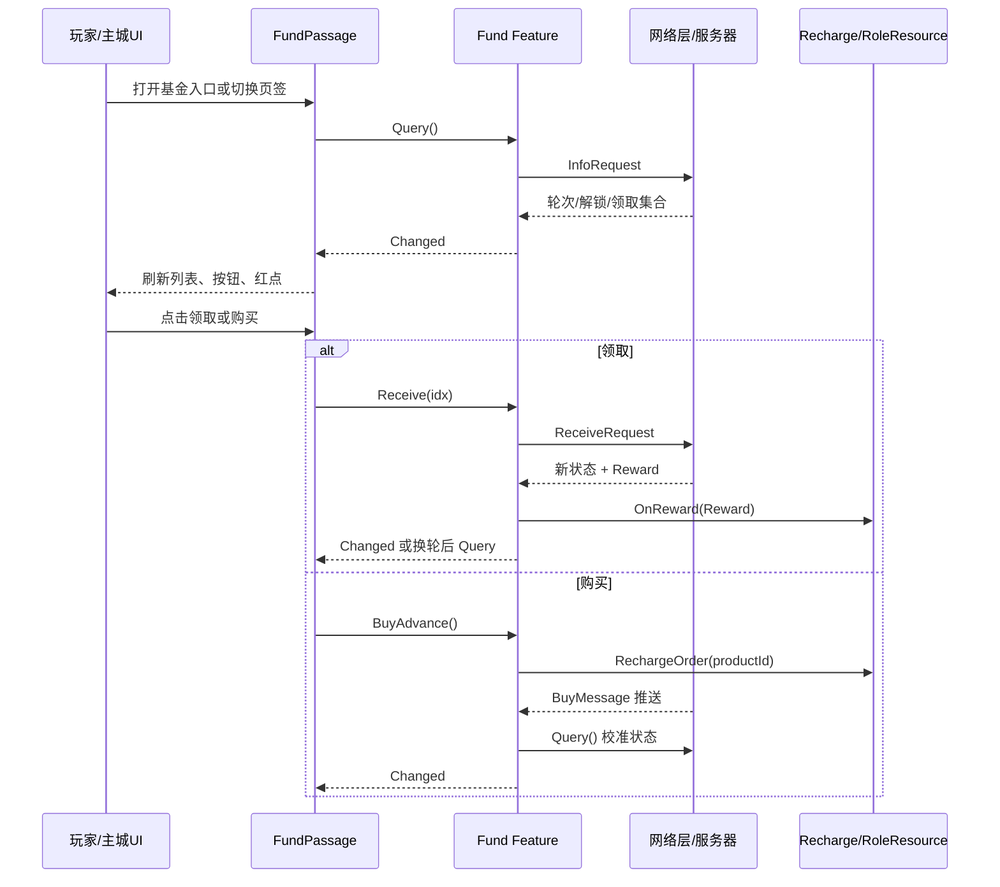

# 锦华基金活动客户端｜项目复盘

> 状态：代码已提交，运行验收结果未知
>
> 公司：广州小画网络科技有限公司
>
> 角色：Unity 客户端开发实习生，负责主线基金与秘境基金的界面接入、协议状态层、购买领取链路、轮次刷新、入口红点及配置补齐
>
> 技术栈：Unity/团结引擎、C#、UGUI、Protobuf、Luban、异步 Task、事件驱动、HybridCLR 热更程序集
>
> 一句话成果：在既有基金聚合界面中落地主线基金和秘境基金两类商业活动，打通“入口查询—页面展示—购买—领取—奖励入账—轮次刷新—红点反馈”的客户端闭环，并通过异步互斥与状态校验避免重复查询、重复领取和重复购买。

## 1. 项目背景与目标

### 背景与痛点

项目是包含多玩法、多活动和多渠道版本的 Unity 商业游戏。基金页面不是独立静态 UI，而是聚合主线、召唤、占星、爬塔、秘境等多种基金的统一入口。新增基金类型需要同时接入配置、协议、Feature 状态、购买系统、奖励展示、红点和页面生命周期。

从 SVN 记录看，我在版本 1743 完成主线基金页面与前端协议接入，在 1783 补齐购买状态和入口可领取红点，在 1786 补充主线基金配置数据，在 1793 继续落地秘境基金的 P812 协议、购买领取、轮次刷新、红点和界面资源。这构成了一条连续迭代而非单次页面拼接。

### 需求目标

- 在统一基金界面增加主线基金与秘境基金页签，读取对应 Luban 配置并生成奖励列表。
- 请求服务器基金状态，准确展示当前轮次、高级基金购买状态、已解锁档位与已领取集合。
- 支持普通/高级奖励领取、充值购买和购买成功推送后的界面刷新。
- 一轮奖励结束后切换至下一轮，防止 UI 使用上一轮配置或旧状态。
- 在主城基金入口聚合多个基金的可领取状态，展示感叹号红点。
- 避免按钮连点导致重复查询、重复购买或重复领取。

### 我的职责

已验证的个人改动覆盖：新增 `MainLineFund`、`SecretRealmFund` 两个 Feature；接入 P810/P812 消息结构；修改基金聚合页、主城入口和通用红点；补充主线基金表数据；导入基金页签及背景资源。提交作者为 `ouxiaotong`，相关 SVN 版本为 1743、1783、1786、1793。

不能归为个人成果的部分包括：底层网络请求框架、充值系统、奖励入账系统、Feature 管理器、Protobuf/Luban 生成框架和基金聚合页原有其他基金逻辑。这些是我复用的项目基础设施。

### 范围与约束

- 业务代码位于 HybridCLR 的 Hotfix 程序集，需要沿用项目 Feature、Manager、GUI 和配置访问方式。
- 页面复用同一个 `FundPassage`，新增类型不能破坏其他基金。
- 状态以服务器返回为准；客户端只做展示、前置校验和交互防重。
- 购买由充值模块发起，最终状态通过服务器购买推送确认，不能在支付调用返回时直接假设解锁成功。
- 当前没有发现自动化测试、联调日志、性能数据或产品验收记录，因此不能声称已经上线、提升收入或零缺陷。

## 2. 方案设计与权衡

### 整体方案

采用“UI 聚合层 + 每种基金独立 Feature 状态层 + 项目通用网络/充值/奖励基础设施”的结构：

1. `EntryButtonPanel` 在主城进入时查询基金状态并聚合红点。
2. `FundPassage` 根据基金类型加载配置、构建统一的 `FundRewardData`，并订阅 Feature 的 `Changed` 事件。
3. `MainLineFund` / `SecretRealmFund` 封装查询、领取、购买和推送处理，保存服务器状态集合。
4. 网络请求由 `GameMessageManager.CallRequest<T>` 完成；充值交给 `Recharge.RechargeOrder`；奖励回包交给 `RoleResource.OnReward`。
5. Feature 更新后通过事件驱动 UI 重建列表、刷新价格、轮次和按钮状态。

### 为什么这样设计

- 将服务器状态和请求逻辑放入 Feature，避免 UI 直接散落协议调用，入口红点与活动页面也能复用同一份状态。
- 用 `HashSet<int>` 保存解锁和领取索引，使档位状态判断接近 O(1)，也自然去除重复索引。
- 购买采用“发起充值—等待服务器推送—重新查询”的方式，避免客户端支付回调与服务器真实入账状态不一致。
- 轮次变化后重新 `Query()`，因为领取响应只包含领取集合等核心状态，下一轮完整的 `unlocked_idx` 等信息仍需重新拉取。
- UI 使用统一 `FundRewardData` 适配多类基金，减少为每种基金复制整套 Cell 和交互代码。

### 备选方案与取舍

可以把所有基金塞入一个巨型 Feature，但会形成大量类型分支，状态字段也因活动规则不同而互相污染；当前每种基金独立 Feature 更利于维护。另一种方案是抽象统一 `IFundFeature`，进一步消除 `MainLineFund` 与 `SecretRealmFund` 的重复代码，但会扩大此次改动范围，且不同基金已有时间型、轮次型等差异，因此当时选择小步接入更稳妥。

## 3. 架构与完整逻辑代码链条

### 模块职责

| 模块 | 职责 | 输入 | 输出/副作用 |
|---|---|---|---|
| `EntryButtonPanel` | 创建基金入口、查询多个基金、聚合红点 | 主城界面生命周期、Feature 事件 | 入口显示、感叹号红点 |
| `FundPassage` | 页签切换、配置转 UI 数据、按钮交互 | 基金类型、配置表、Feature 状态 | 奖励 Cell、价格、轮次、提示 |
| `MainLineFund` | P810 状态管理 | 查询/领取响应、购买推送 | 状态集合与 `Changed` 事件 |
| `SecretRealmFund` | P812 状态管理 | 查询/领取响应、购买推送 | 状态集合与 `Changed` 事件 |
| `Recharge` | 创建充值订单 | 商品 ID | 支付流程；最终结果由服务器推送确认 |
| `RoleResource` | 处理奖励变化 | `PbResourceChanging` | 奖励展示与角色资源更新 |
| Luban 配置 | 定义档位、奖励、商品等静态数据 | Excel 生成数据 | 页面奖励列表与商品 ID |

### 总体流程图



### 完整成功调用链

打开主城时，`EntryButtonPanel.Init/Enter` 绑定各基金 `Changed` 事件并执行基金状态查询。入口对象异步创建完成后设置图标和感叹号展示类型，再根据 `HasClaimableReward` 聚合结果刷新红点。销毁时解除事件，避免页面重建后重复订阅。

玩家打开 `FundPassage` 并切到主线或秘境页签后，页面保存当前 `EFundType`，从 Luban 表读取当前轮次档位与奖励，构造成统一的 `FundRewardData`；随后调用对应 Feature 的 `Query()`。查询响应写入 `Round`、`IsUnlock`、`IsFinished`、普通已领集合、高级已领集合和已解锁索引集合，并触发 `Changed`。UI 只在当前页签匹配时响应事件，刷新奖励列表、购买按钮、轮次与总奖励。

领取时，UI 先依据 `CanReceive(idx)` 校验解锁和领取状态，再将 idx 加入 `receivingIndexes` 防止同一档位重复点击。Feature 发出领取请求；成功后覆盖服务器状态，将 `Reward` 交给 `RoleResource.OnReward`。如果响应轮次与请求前不同且活动未结束，则重新查询新轮完整状态；否则直接发出 `Changed`。最终 UI 重建档位状态并移除领取中的 idx。

购买时，页面先检查活动结束、已经购买和 `purchasing` 标记。Feature 读取商品 ID并调用统一充值模块。支付完成后的权威状态不是由页面本地修改，而是由 `ZhuXianJiJinBuyMessage` / `MiJingJiJinBuyMessage` 推送更新；未结束时再查询一次服务器全量状态，然后触发 UI 刷新。

### 失败、重试与补偿链路

- 查询、领取响应为 `null` 时返回 `false`，不篡改已有状态；`finally` 确保 `querying` / `receiving` 复位。
- `querying`、Feature 级 `receiving`、UI 的 `receivingIndexes` 和 `purchasing` 形成多层防重：分别约束重复查询、并发领取、同档位连点和重复拉起支付。
- 未解锁、已结束、已领取或未购买高级基金时在请求前拦截，并由 UI 给出提示。
- 配置商品 ID 缺失或无法解析时，秘境基金购买返回失败，不用无效商品 ID 发起充值。
- 购买推送到达后重新查询，补偿支付链路与页面本地状态的时序差异。
- 换轮时重新查询，补偿领取响应不携带下一轮全部解锁信息的问题。
- 未发现显式网络超时重试或指数退避；推断由底层 `CallRequest` 统一处理，但当前证据不足，标记为未知。

### 数据流、状态与生命周期

| 字段 | 来源 | 变化时机 | 消费者 | 风险控制 |
|---|---|---|---|---|
| `Round` | 查询/领取/购买推送 | 查询成功、领取成功、购买推送 | 配置筛选、轮次文本 | 换轮后重新查询 |
| `IsUnlock` | 服务器 | 查询、领取、购买推送 | 高级奖励状态、购买按钮 | 不在客户端乐观置真 |
| `IsFinished` | 服务器 | 查询、领取、购买推送 | 页面关闭/禁用交互 | 请求前校验 |
| `normalReceived` | 服务器索引集合 | 查询、领取 | 普通奖励状态 | HashSet 去重 |
| `advanceReceived` | 服务器索引集合 | 查询、领取 | 高级奖励状态 | 与购买状态联合判断 |
| `unlockedIndexes` | 服务器 | 查询 | 是否允许领取 | 不靠本地进度猜测 |
| `HasServerData` | 客户端 | 首次有效查询/推送 | 红点是否可信 | 无数据时不显示可领取 |
| `receivingIndexes` | UI | 点击领取到异步结束 | Cell 交互 | `finally` 移除 |

Feature 的 `Clear()` 会清空集合、状态和事件；基金页面销毁时解除订阅并清空交互标记；主城入口销毁时同样解绑 Feature。该生命周期处理能降低重复回调和对已关闭 UI 更新的风险。

### 配置、网络、存储或平台链路

静态档位与奖励来自 Luban 生成表，主线基金曾在 SVN 1786 补齐缺失 Excel 数据并同步生成二进制表。秘境基金商品 ID通过常量表 `product_id` 读取，减少业务代码硬编码；主线基金当前仍存在硬编码商品 ID，是可改进点。

P810/P812 各包含三类协议：信息查询、按 idx 领取、购买成功推送。客户端保存协议返回的轮次与集合，而实际奖励以服务器返回的 `PbResourceChanging` 为准。此功能未见本地持久化，重新进入后以服务器查询恢复状态。平台支付差异由项目 `Recharge` 层屏蔽，本 Feature 不直接调用渠道 SDK。

## 4. 核心代码与数据结构

### 核心类与接口

- `MainLineFund` / `SecretRealmFund`：状态领域层，提供 `Query`、`Receive`、`BuyAdvance`、`CanReceive` 和 `HasClaimableReward`。
- `FundPassage`：统一页面控制器，将不同基金配置和状态投影为 `FundRewardData`。
- `FundRewardData`：UI DTO，保存轮次、进度、普通/高级奖励、解锁与领取状态、领取回调。
- `EntryButtonPanel`：入口层，聚合多基金的 `HasClaimableReward`。

### 关键字段、DTO 与配置

核心判定可以简化为：档位必须未结束且已解锁；普通奖励未领即可领取；若普通已领，则只有购买高级基金且高级奖励未领时仍可领取。

```csharp
bool CanReceive(int idx)
{
    if (IsFinished || !unlockedIndexes.Contains(idx)) return false;
    return !normalReceived.Contains(idx)
        || IsUnlock && !advanceReceived.Contains(idx);
}
```

### 入口与上下文构建

页面根据 `EFundType` 选择 Feature 和配置表，把当前轮的每个档位转换成统一 DTO。DTO 中同时保留静态奖励数据与服务器动态状态，从而让通用 Cell 不需要认识 P810/P812 协议。

### 核心业务代码

以下为保持真实语义的脱敏伪代码：

```csharp
async Task<bool> Receive(int idx)
{
    if (receiving || !CanReceive(idx)) return false;
    receiving = true;
    try {
        int oldRound = Round;
        var rsp = await RequestReceive(idx);
        if (rsp == null) return false;

        ApplyServerState(rsp);
        if (rsp.Reward != null)
            await ApplyRoleReward(rsp.Reward);

        if (!IsFinished && oldRound != Round)
            await Query();
        else
            Changed?.Invoke();
        return true;
    }
    finally { receiving = false; }
}
```

### 回调、状态更新与最终结果

```csharp
async void OnBuyMessage(BuyMessage msg)
{
    Round = msg.Round;
    IsUnlock = msg.IsUnlock;
    IsFinished = msg.IsFinished;
    HasServerData = true;

    if (IsFinished) Changed?.Invoke();
    else await Query();
}
```

关键点是购买推送只先更新最小状态，随后查询全量数据，最终由 `Changed` 将更新广播给基金页面和主城红点入口。

### 完整成功流程伪代码

```text
当玩家进入秘境基金并领取档位 3：
1. 页面切换至 SecretRealm，读取当前轮配置并请求 P812001。
2. Feature 覆盖轮次、购买态、结束态和三个索引集合，触发 Changed。
3. 页面把 idx=3 映射为 FundRewardData，并确认 CanReceive=true。
4. 点击后 UI 把 3 加入 receivingIndexes，Feature 把 receiving 置 true。
5. 客户端发送 P812002(idx=3)。
6. 服务端返回最新领取集合与 Reward。
7. Feature 更新状态，RoleResource 消费 Reward 并展示/入账。
8. 若轮次改变则重新请求完整状态，否则直接 Changed。
9. 页面刷新 Cell 和入口红点，finally 清除两层领取锁。
```

### 典型失败流程伪代码

```text
当玩家连续点击同一领取按钮：
1. 第一次点击将 idx 加入 receivingIndexes 并开始请求。
2. 第二次点击无法再次 Add 同一 idx，UI 层直接返回。
3. 即使绕过 UI，Feature 的 receiving=true 仍会拒绝并发领取。
4. 若网络返回 null，状态不被覆盖。
5. finally 移除 idx 并恢复 receiving，允许玩家稍后重试。
```

### 脱敏和省略说明

文档保留类名、状态结构和协议职责，但不发布完整公司源码、内部仓库地址、资源原图、完整配置数据和业务数值。商品具体 ID已省略；协议编号仅保留用于说明模块边界的 P810/P812 名称。代表性代码已压缩为最小逻辑单元。

## 5. 测试验证与实际效果

### 测试矩阵

| 场景 | 操作 | 预期 | 实际 | 状态 |
|---|---|---|---|---|
| 初次进入基金 | 打开页面并切换主线/秘境 | 查询状态并显示当前轮奖励 | 源码链路已验证，运行结果未知 | 待 Unity 联调 |
| 普通奖励领取 | 点击已解锁未领取档位 | 奖励入账、Cell 与红点刷新 | 代码路径已验证 | 待服务端联调 |
| 高级基金购买 | 点击购买并完成支付 | 收到推送后重新查询并解锁高级奖励 | 推送链路已验证 | 待渠道支付验证 |
| 连续点击领取 | 快速点击同一档位 | 只发起一次有效领取 | 双层互斥代码已验证 | 待抓包确认 |
| 轮次切换 | 领取本轮最后档位 | 刷新下一轮完整数据 | 有轮次比较与 Query 补偿 | 待构造账号验证 |
| 活动结束 | 服务端返回结束态 | 禁止购买领取并刷新/关闭展示 | 分支已验证 | 待运行验证 |
| 入口红点 | 任一基金存在可领取奖励 | 主城入口显示感叹号 | 聚合代码与事件链已验证 | 待 UI 验收 |
| 页面反复开关 | 多次进入退出 | 不重复订阅、不残留交互锁 | 有解绑和 Clear 逻辑 | 待运行验证 |

### 日志与观测点

当前未保存专用业务日志。后续联调应抓取：查询/领取请求次数、响应轮次、购买推送到达时间、领取前后索引集合、`RoleResource` 奖励变化，以及页面打开关闭后的事件订阅次数。

### 已验证工程效果

- SVN 证据证明两类基金从 Feature、协议结构、UI、入口红点到配置/资源均有连续提交。
- 源码确认查询、领取、购买推送、奖励处理、换轮刷新和生命周期解绑形成闭环。
- 查询、领取和购买均有明确的防重复机制。
- 主线基金与秘境基金复用统一基金页面和 Cell 数据模型，没有另起重复页面系统。

### 尚未验证的业务效果

未知是否已经上线、覆盖多少用户、产生多少充值、提升多少点击或转化；也没有崩溃率、请求成功率和性能对比数据。简历中不能写营收提升、转化率提升或“零重复领取”。

## 6. 风险复盘与改进

### 遇到的问题与根因

最值得讲的问题是“领取后轮次变化”。若只使用领取响应刷新 UI，下一轮档位的完整解锁数据可能缺失，页面会继续展示旧轮状态。当前通过比较 `previousRound` 与响应 `Round`，发生变化后重新查询完整状态，解决跨轮数据不完整问题。

另一个问题是基金入口红点不能只看当前页面。入口需要聚合多个 Feature 的可领取状态，并在购买、领取或查询后及时刷新，因此使用每个 Feature 的 `Changed` 事件连接入口与页面，同时在销毁阶段统一解绑。

### 当前限制和技术债

- `MainLineFund` 与 `SecretRealmFund` 结构高度相似，可抽取轮次型基金基类或接口，降低后续 P814 等活动复制成本。
- Feature 只有全局 `receiving`，不同档位不能并行领取；这更安全但较保守，可根据服务端幂等能力改成按 idx 锁。
- 购买推送处理使用 `async void`，异常难以上抛和统一观测；可将内部逻辑改成 Task 并显式 `Forget` 记录异常。
- 主线商品 ID存在硬编码，而秘境通过配置读取；应统一配置化并对缺失配置提供可观测错误。
- `Changed` 是无参数事件，UI 每次需要全量重建；后续可携带变更类型或状态快照以减少不必要刷新。
- 未见 Feature 查询失败的用户提示、有限重试或取消令牌；页面关闭后的在途请求仍可能完成并触发事件，需要结合项目网络层进一步验证。
- `FundPassage` 已超过千行且包含多基金分支，长期可拆分为策略/适配器，控制页面复杂度。

### 如果重新设计

我会定义 `IFundState` 与 `IFundAdapter`：状态层统一暴露 Query/Receive/Buy 和不可变快照；每种基金 Adapter 只负责配置表到 DTO 的映射；页面只渲染 DTO。同时加入请求序列号或 CancellationToken，保证切页/关闭后的旧查询不能刷新当前页，并为查询、购买推送、领取和换轮建立结构化日志与联调测试账号。

## 7. 简历与面试材料

### 一句话项目介绍

我在 Unity 商业项目中独立接入了主线基金和秘境基金两类活动，不仅完成界面，还打通了 Protobuf 查询/领取/购买推送、Luban 配置、奖励入账、跨轮刷新和主城红点闭环。

### 简历精简版

- 设计并实现 Unity 基金活动客户端闭环，接入主线/秘境基金的查询、购买、领取及服务器推送，联动 Luban 配置、奖励系统和主城红点，覆盖跨轮刷新与活动结束分支。
- 建立多层异步防重机制，通过查询/领取状态锁、按档位领取锁和购买锁避免 UI 连点造成重复请求，并在页面生命周期中完成事件订阅与解绑。

### 简历技术版

- 基于项目 Feature 架构为 P810/P812 基金活动实现独立状态层，使用 `HashSet` 管理解锁与普通/高级已领取索引，通过事件驱动同步聚合页面和入口红点；领取成功后消费服务端奖励回包，并在轮次变化时二次查询校准完整状态。
- 复用统一 `FundRewardData` 将多张 Luban 配置表和服务器动态状态适配到通用 UGUI Cell，接入充值订单与购买推送，以服务端状态作为高级基金解锁依据，避免客户端乐观更新导致状态不一致。

### STAR 讲述

**S**：项目已有统一基金页面，但新增主线与秘境基金涉及不同配置、独立协议、购买推送、奖励状态和入口红点，单纯拼 UI 无法保证状态一致。

**T**：我负责把两种基金接入现有架构，在不破坏其他基金的前提下完成从主城入口到领取奖励的客户端完整链路，并处理连点、换轮和生命周期问题。

**A**：我为两种基金分别实现 Feature 状态层，保存轮次、购买态、结束态及三组索引集合；页面将配置与状态转换为统一 DTO。查询和领取通过项目网络层发起，奖励交给统一资源模块处理；购买只负责拉起充值，最终以服务器推送和二次查询校准状态。针对异步交互，我增加查询、领取、按档位和购买多层锁；领取导致换轮时重新请求下一轮完整数据；入口订阅 Feature 事件聚合红点，页面销毁时解绑。

**R**：代码和 SVN 记录验证两种基金均完成协议、状态、UI、配置/资源与红点接入，并具备成功、失败、防重和跨轮分支。运行验收和业务指标未留存，因此只陈述工程闭环，不夸大营收结果。

### 3 分钟回答

这个任务表面上是新增基金活动，但技术难点在状态一致性。基金同时有免费和高级两条奖励线，服务器会返回当前轮次、是否购买、活动是否结束、已解锁档位和两组已领取集合。页面还要支持支付后的服务器推送、领取最后一档后的换轮，以及主城入口红点。

我的做法是把协议和状态放进独立 Feature，而不是让 UI 直接请求。Feature 提供 Query、Receive、BuyAdvance 和 CanReceive，使用 HashSet 管理索引状态。UI 从 Luban 表读取静态奖励，再和 Feature 的动态状态合并成统一 FundRewardData，所以通用 Cell 可以复用。

领取成功后，我先覆盖服务器返回状态，再把奖励回包交给 RoleResource。如果响应轮次发生变化，我不会直接用旧列表刷新，而是重新查询下一轮完整信息。购买也不会在调用充值成功时本地置为已购买，而是等待服务器购买推送，再二次查询校准。这两个设计保证客户端展示以服务端为准。

为了处理连点，我在 Feature 有 querying/receiving，在 UI 有按 idx 的 receivingIndexes 和 purchasing；所有标记都在 finally 中恢复。入口和页面通过 Changed 事件刷新，销毁时解绑。最终代码证据覆盖了完整工程链路，但我没有保留上线指标，所以简历只写可验证的技术结果。

### 高频追问与答案

1. **为什么不把请求写在 UI？** 状态同时被活动页和主城红点消费，放在 Feature 可复用并隔离协议，UI 只负责展示。
2. **核心数据结构是什么？** 三个 `HashSet<int>` 分别保存普通已领、高级已领和已解锁 idx，配合轮次、购买态和结束态完成 O(1) 状态判断。
3. **为什么购买后还要 Query？** 支付调用成功不等于服务器业务状态已落地；购买推送是权威通知，Query 用于取得完整领取和解锁集合。
4. **为什么换轮后再查一次？** 领取响应不足以重建下一轮全部状态，必须获取新轮完整数据，避免旧配置与新轮次混用。
5. **如何避免重复领取？** UI 按 idx 锁防同按钮连点，Feature 全局 receiving 防其他入口并发，服务端仍应承担最终幂等。
6. **失败怎么办？** null 响应不覆盖状态，finally 恢复锁；当前未发现业务层自动重试，后续应补错误提示与可观测日志。
7. **红点怎么更新？** 各 Feature 计算 `HasClaimableReward`，主城入口订阅 `Changed` 并聚合；销毁时解绑。
8. **最大的技术债？** 多种基金重复状态代码和超大聚合 Controller，适合抽象接口与 Adapter，但需要避免过度设计。
9. **用户量扩大有影响吗？** 客户端集合规模很小，不是数据量瓶颈；更需关注频繁全量刷新、网络重试和支付状态观测。
10. **你个人做了什么？** 可由四次 SVN 提交证明：新增两类 Feature/PBStruct，修改基金页面、入口红点与配置，并接入资源。
11. **如何测试？** 使用不同轮次和购买态账号覆盖首次查询、领取、连点、购买推送、最后一档换轮、结束态、断网和反复开关页面，并抓包验证请求次数。
12. **业务价值是什么？** 工程上提供了可操作的基金商业活动入口；具体营收和转化没有证据，不能量化。

### 不能夸大的内容

- 不说“独立设计整个活动框架”，因为框架、网络、充值和奖励系统均为既有能力。
- 不说“负责服务端协议设计”，现有证据只能证明客户端接入生成后的消息结构。
- 不说“提升充值转化/收入”，没有数据。
- 不说“完全避免重复领取”，客户端只做防重，最终幂等仍依赖服务端。
- 不把 Addressables 资源管理写成本项目个人优化成果；当前只能说理解并使用项目资源体系。

## 8. 重新学习清单

### 推荐复习顺序

1. 闭卷画出“入口—页面—Feature—网络—奖励/充值—事件刷新”时序图。
2. 复述 `CanReceive` 的普通/高级两条判断逻辑。
3. 解释购买推送后 Query、领取换轮后 Query 的区别。
4. 复述四层防重标记及各自生命周期。
5. 对照 SVN 版本说清楚自己的提交范围与非个人基础设施。

### 必须掌握的概念

Protobuf 请求/响应与服务器推送、Luban 静态配置、事件订阅生命周期、Task 异步异常与 `finally`、客户端防重和服务端幂等的区别、服务端权威状态、UI DTO/Adapter、HashSet 复杂度、HybridCLR 热更程序集边界。

### 自测题

- 如果购买推送先于支付 UI 回调到达，当前设计为什么仍能工作？
- 如果领取最后一档后服务器直接切轮，哪些字段会变化，为什么必须 Query？
- `HasServerData` 对入口红点有什么意义？
- 页面关闭时网络请求尚未结束，当前实现可能有什么风险，如何改进？
- 如何抽象轮次型基金而不强迫时间型基金使用不合适的字段？
- 客户端已有两层领取锁，为什么服务端仍必须做幂等？

## 9. 证据与脱敏说明

| 证据 | 当时位置/版本 | 提取的关键信息 | 脱敏说明 |
|---|---|---|---|
| SVN 提交 1743 | `ouxiaotong` | 新增主线基金 Feature/P810 结构，修改基金页并加入资源 | 未复制资源和完整源码 |
| SVN 提交 1783 | `ouxiaotong` | 完善购买状态、主城入口红点，并调整多种基金状态 | 仅保留职责描述 |
| SVN 提交 1786 | `ouxiaotong` | 补充主线基金 Excel 与生成表数据 | 未公开表内业务数值 |
| SVN 提交 1793 | `ouxiaotong` | 新增秘境基金 Feature/P812，完成购买领取、换轮、红点和资源 | 协议字段仅做结构说明 |
| `MainLineFund` / `SecretRealmFund` | 当前 SVN 工作副本 r1824 | Query、Receive、BuyAdvance、购买推送、集合状态与异步锁 | 代码压缩为伪代码，商品 ID省略 |
| `FundPassage` | 当前 SVN 工作副本 r1824 | 统一 DTO、页签适配、按 idx 防重、轮次/UI 刷新和事件解绑 | 未复制千行控制器 |
| `EntryButtonPanel` | 当前 SVN 工作副本 r1824 | 主城入口查询、红点聚合、事件绑定与解绑 | 未保留其他活动私有逻辑 |
| P810/P812 生成消息 | 当前 SVN 工作副本 r1824 | 信息、领取、购买推送三类协议及核心状态字段 | 不公开内部仓库地址与完整生成代码 |

事实等级说明：源码结构、提交作者、版本与分支行为为已验证；“运行时能够正常完成支付/领取”“已上线”及业务指标为未知；底层网络超时与服务端幂等属于合理要求，但本次客户端证据无法确认其具体实现。
